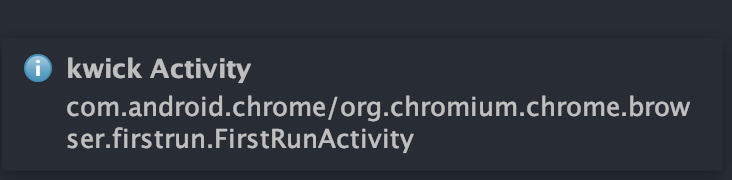
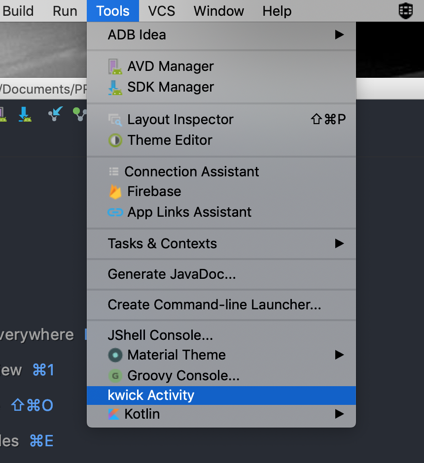
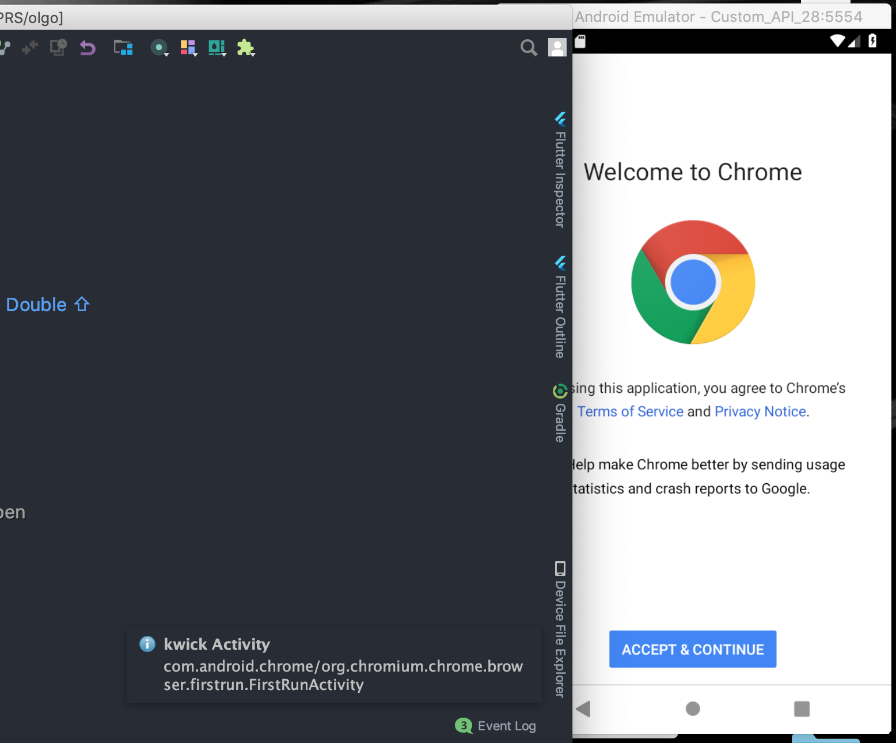

# kwick Activity

A simple Android Studio plugin that displays the current focused activity
on a connected device/emulator.

[Link to the plugin.](https://plugins.jetbrains.com/plugin/12073-kwick-activity)

### How to use

After installing the plugin, there will be an option under the `Tools` menu
titled `kwick Activity` that looks something like this :

Clicking it will display the focused activity in the bottom right Notification tray.

### Errors

The plugin runs an ADB command to find the focused activity. Make sure there is only a single debuggable
device connected and available to adb.

The possible errors this plugin will display are ->

* `Could not find adb.` : Android sdk is not found from the project.
* `Error running adb command : ` :  adb path is found but
some error occurred when running the adb command. Error message is followed
by the hyphen.
* `Could not find activity.` : The adb command was run but no activities were found.

